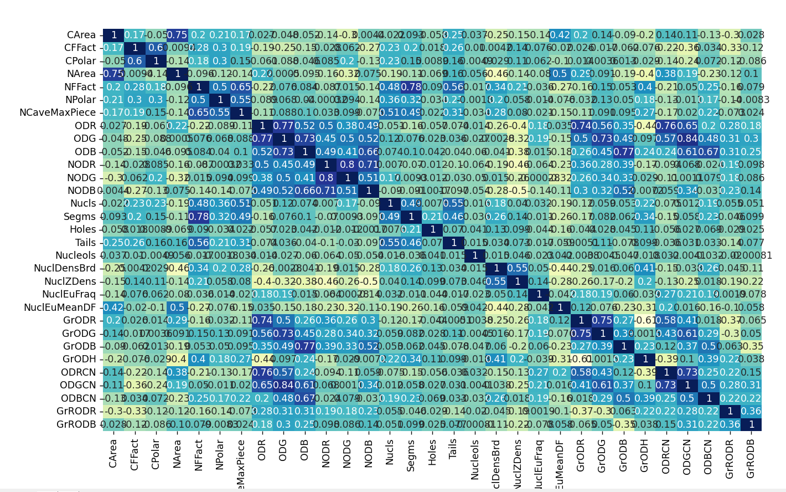
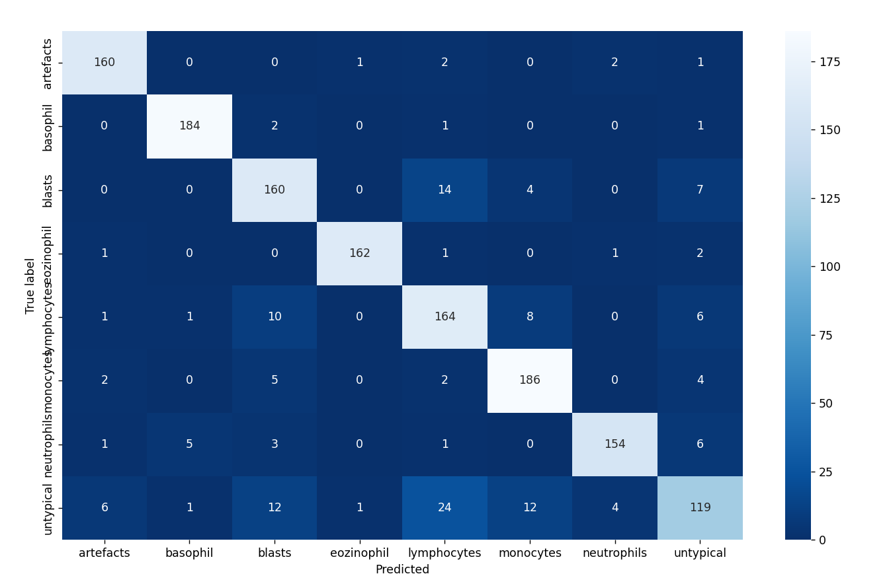

<h1> Классификация клеток крови на 7 групп + артефакты </h1> 

<h4>Цель работы: </h4>

Данная работа направлена на классификацию 7 типов лейкоцитов и артефактов. 
В ходе исследования мы будем обучать и тестировать ML-модель.
< / p>

<h4>Описание данных:</h4>

Данные содержат информацию о различных параметрах клеток крови.  
Например, площадь клетки, площадь цитоплазмы, площадь ядра, количество ядер, количество гранул, радиус клетки, радиус ядра и т.д...
< / p>

<h4>План работы:</h4>

1. Загрузка данных

2. Анализ данных

3. Модель обучения

4. Результаты

   
 
<h4>Загрузка и анализ данных</h4>

В данных имеются 36 столбцов и 7560 строк. Пропусков в данных не выявлено. 

В ходе анализа данных были выявлены сильные аномалии в столбцах. 
NCCave, ODB, NODB, GrRODB, CArea, NFFact, NODG, GrODH, ODBCN.
Анамалии в данных столбцах были устранены. 

Были выявлены столбцы с  мультиколлинеарность 

NFFact -NCCave

NArea- NuclEuFFDist

NuclEuFFChane - NuclEuFFDist

GrRODR - GrRODG
Данные столбцы були удалены 
#'NCCave','NuclEuFFDist','GrRODG'

Результат 

<h4>Обучение и результат модели </h4>

Обучение модели. 
Было обучено две модели: RandomForestClassifier и CatBoostClassifier 

Модель RandomForestClassifier
Параметры модели  RandomForestClassifier(max_depth=20, n_estimators=500, random_state=42)
(Параметры подбирались с использованием GridSearchCV)
Результаты

Overall Accuracy: 0.8919667590027701
Overall Precision: 0.8924125307684136
Overall Recall: 0.8917908465415643

 
Модель CatBoostClassifier 

Результаты 

Overall Accuracy: 0.8760387811634349
Overall Precision: 0.8758972783519532
Overall Recall: 0.8742768929793181

Вывод 

Модель RandomForestClassifier показало более лучшию рабастность чем CatBoostClassifier.
